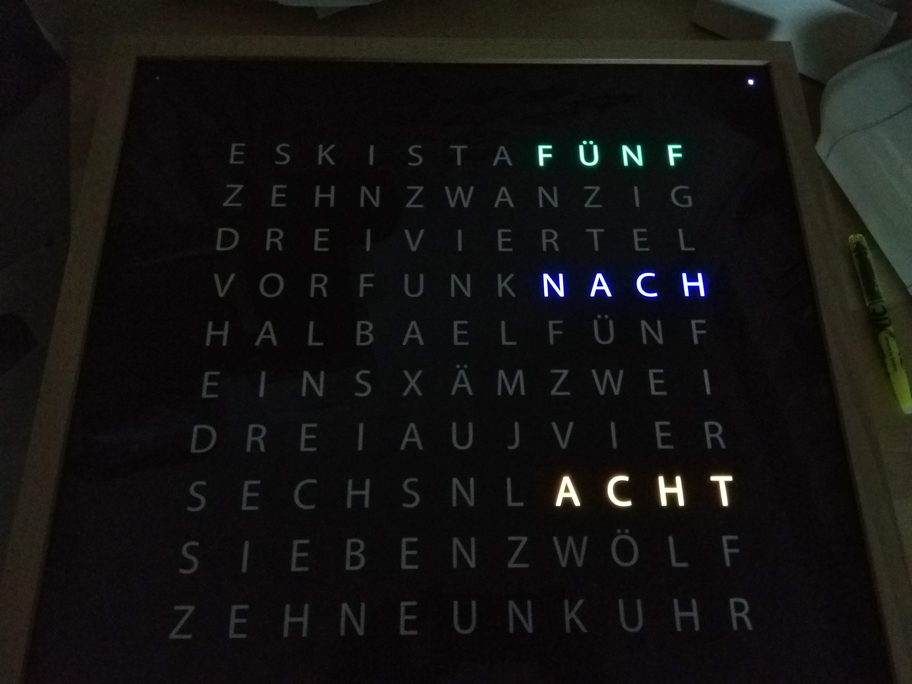
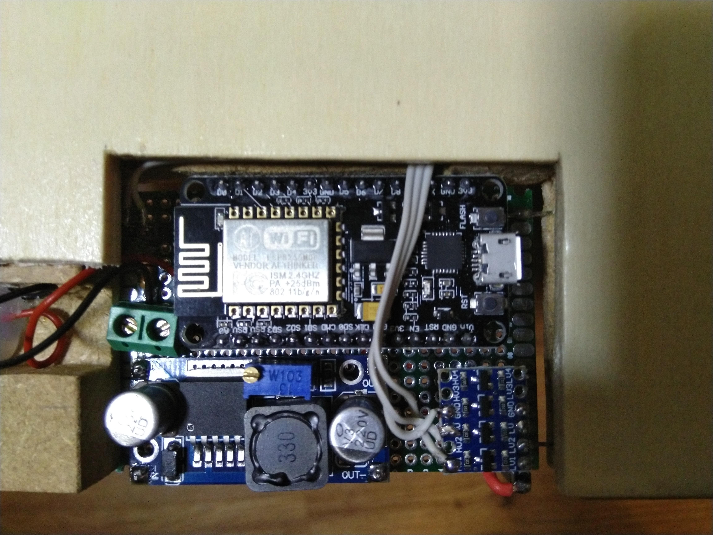
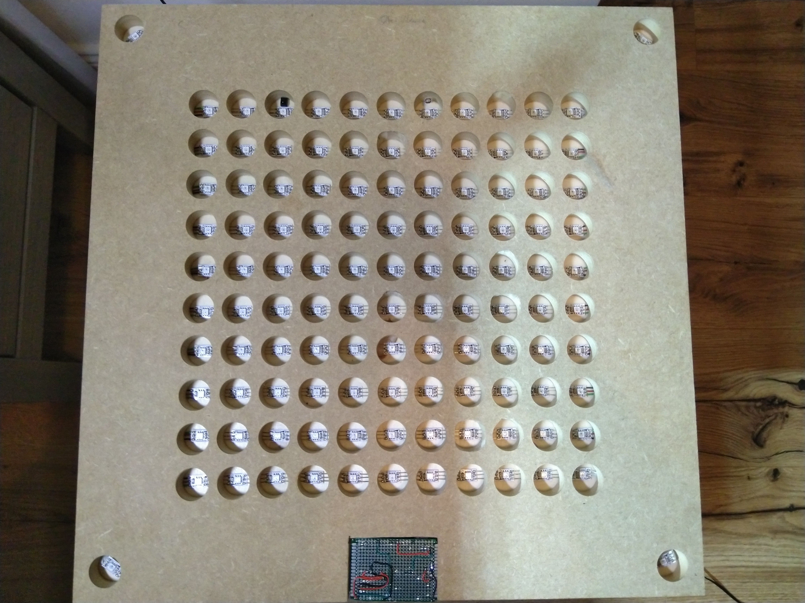

##Wordclock based on an ESP8266 / WS2812

###Hardware:
- LDR with voltagedevider on A0 
- WS2866 via levelshifter on RXD0 

###Features:
- defineable hardware layout (leds.h)
- word fading
- display hour and minutes
- display seconds
- display temperature
- 8 different color modes with HUE rotate
- wifimanger
- Webserver http://deviceip:80
- OTA
- mdns
- NTP time client
- MQTT Sub: ON/OFF && BRIGHTNESS && COLORMODE && DISPLAYMODE (Non persistent)
- MQTT Pub: current config as JSON to broker
- LDR driven brightness

##Todos befor V1.0:
###Addons
- tempsensor implementation
###Bugfixing

##Images

