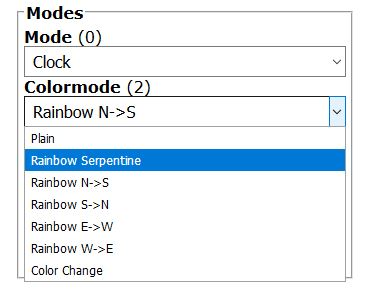

# Wordclock based on an ESP8266 / WS2812


## Hardware:
- LDR with voltagedevider on A0 
- WS2812 via levelshifter on RXD0 


## Supported Layouts:
#Ikeahacker caschoff.de (page gone):
```
E S _ I S T _ F Ü N F
Z E H N Z W A N Z I G
D R E I V I E R T E L
N A C H F U N K V O R  
H A L B _ E L F Ü N F
E I N S _ _ _ Z W E I
D R E I _ _ _ V I E R
S E C H S _ _ A C H T
S I E B E N Z W Ö L F
Z E H N N E U N U H R
```

#ulrichradig.de (project gone):
```
E S _ I S T _ F Ü N F
Z E H N Z W A N Z I G
D R E I V I E R T E L
_ _ N A C H V O R _ _  
H A L B _ Z W Ö L F _
Z W E I N S I E B E N
_ D R E I _ _ F Ü N F
E L F N E U N V I E R
_ A C H T Z E H N _ _
_ S E C H S _ U H R _
```

#mikrocontroller.net:
```
E S _ I S T _ F Ü N F
Z E H N Z W A N Z I G
D R E I V I E R T E L
_ _ N A C H V O R _ _  
H A L B _ Z W Ö L F _
Z W E I N S I E B E N
_ D R E I _ _ F Ü N F
E L F N E U N V I E R
_ A C H T Z E H N _ _
_ S E C H S _ _ U H R
```

## Features:
- defineable hardware layout (leds.h)
- word fading
- display hour and minutes
- display seconds
- display temperature
- display marquee text
- display startscreen
- scheduled Auto ON / OFF Times
- 8 different color modes with HUE rotate
- wifimanger
- Webserver http://deviceip:80 ( inspired by Tasmota and tzapu/wifimanager )
- OTA
- mdns
- Websocket Webconsole
- NTP time client
- MQTT Sub: ON/OFF && BRIGHTNESS && COLORMODE && DISPLAYMODE (Non persistent)
- MQTT Pub: current config as JSON to broker
- LDR driven brightness


## Images





