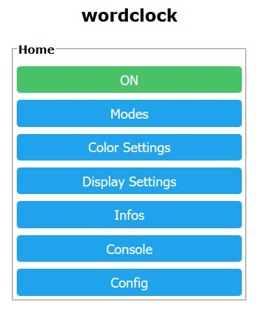
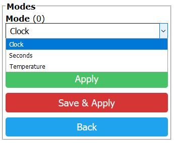
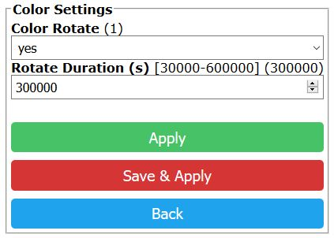
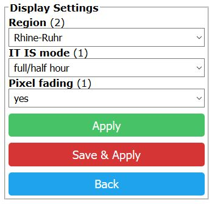
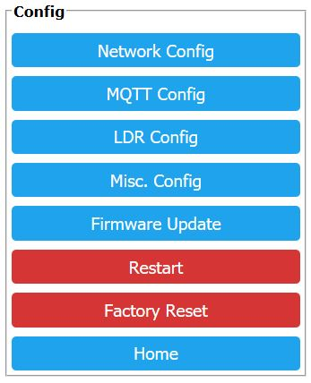

# Wordclock based on an ESP8266 / WS2812

## Hardware:
- LDR with voltagedevider on A0 
- WS2866 via levelshifter on RXD0 

## Features:
- defineable hardware layout (leds.h)
- word fading
- display hour and minutes
- display seconds
- display temperature
- 8 different color modes with HUE rotate
- wifimanger
- Webserver http://deviceip:80 ( inspired by Tasmota and tzapu/wifimanager )
- OTA
- mdns
- Websocket Webconsole
- NTP time client
- MQTT Sub: ON/OFF && BRIGHTNESS && COLORMODE && DISPLAYMODE (Non persistent)
- MQTT Pub: current config as JSON to broker
- LDR driven brightness

## Todos befor V1.0:
### Addons
- tempsensor implementation
### Bugfixing
- TBD

## Images

